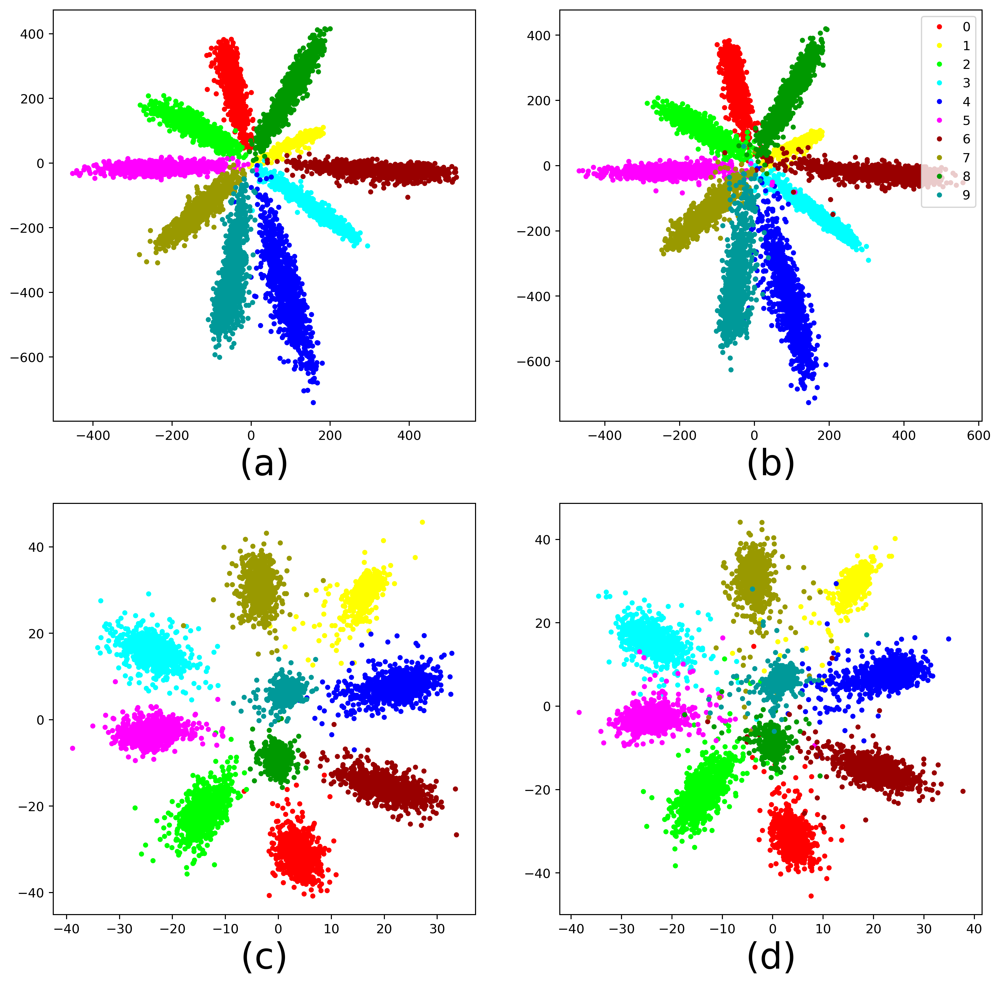

# Pairwise Gaussian Loss

## Introduction

We introduce a pairwise gaussian loss (PGL) for convolutional neural networks. PGL can greatly improve the generalization ability of CNNs, so it is very suitable for general classification, feature embedding and biometrics verification. We give the 2D feature visualization on MNIST to illustrate our PGL.

## Test

I'm playing with [PyTorch](http://pytorch.org/) on the MNIST, CIFAR10, CIFAR10+,
 CIFAR100, CIFAR100+, SVHN and ImageNet dataset.
 
For MNIST, CIFAR10, CIFAR100 and SVHN, there is no need to download, it is downloaded automatically when called.

For ImageNet, refer to the [link](https://github.com/ccq1n/pytorch_model_integration). Place train and val in the
./data/train and ./data/val folders, respectively. Set the data path to ./data.

## Model
- VGG
- [ResNet18](https://arxiv.org/abs/1512.03385) 
- [MobileNetV2](https://arxiv.org/abs/1801.04381) 
- [ResNeXt29(32x4d)](https://arxiv.org/abs/1611.05431) 
- [DenseNet121](https://arxiv.org/abs/1608.06993) 
- [PreActResNet18](https://arxiv.org/abs/1603.05027) 

Note: Base on original ResNet-50, we find high-dimensional features are not conducive to the calculation of
 distance on _**ImageNet**_. So we add a full connection layer with 512-node to ResNet-50, reduce the dimensional of features.

## Learning rate adjustment
I manually change the `lr` during training:
- `0.01` for epoch `[0,50)`
- `0.001` for epoch `[50,100)`
- `0.0001` for epoch `[100,150)`

Resume the training with `python main.py`
## Prerequisites
- Python 3.6+
- Pytorch 1.0+

## Compare with double-channel network
[SCNet](https://www.researchgate.net/profile/Yimin_Luo2/publication/330708746_Separability_and_Compactness_Network_for_Image_Recognition_and_Superresolution/links/5c51e814a6fdccd6b5d4f2b1/Separability-and-Compactness-Network-for-Image-Recognition-and-Superresolution.pdf) is proposed 
to calculate the compact loss between samples.

As shown in the table below, we use a single-channel network structure that is superior to the previous double-channel structure in terms of resource utilization and time consumption.

| Network       | Architecture   | Params  | FLOPs   | CPU       |   
| ------------- | -------------- | ------- | ------- | --------- | 
| VGG-16        | single-channel | 15.23M  | 30.78G  | 219.63ms  |
| ResNet-152    | single-channel | 60.19M  | 23.15G  | 503.28ms  |
| DenseNet-121  | single-channel | 20.01M  | 8.63G   | 542.40ms  |
| ------------- |
| VGG-16        | double-channel | 29.95M  | 61.57G  | 517.39ms  |
| ResNet-152    | double-channel | 118.33M | 46.29G  | 1087.10ms |
| DenseNet-121  | double-channel | 38.10M  | 17.25G  | 1326.87ms |